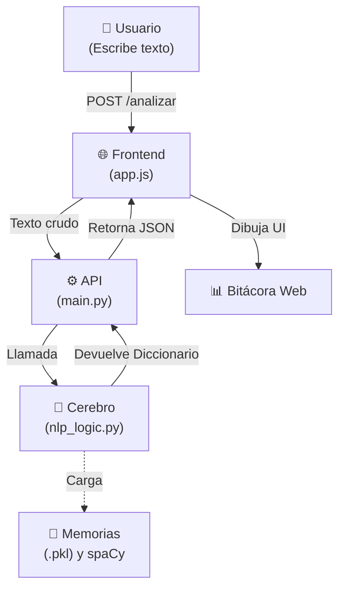

# Evolución del Proyecto: De Colab a Aplicación Web (IA)

## 1. ¿Qué pasó con el código principal?

A modo de registro, este era el código original proveniente de Google Colab:

<details>
<summary><b>Haz clic aquí para desplegar el código original de Colab</b></summary>

```python

# Instalar bibliotecas necesarias

!pip install -q spacy scikit-learn pandas
!python -m spacy download es_core_news_sm


# Importar módulos

import pandas as pd
import spacy
from sklearn.feature_extraction.text import TfidfVectorizer
from sklearn.naive_bayes import MultinomialNB, ComplementNB
from sklearn.pipeline import Pipeline
from sklearn.model_selection import train_test_split
from sklearn.metrics import classification_report

nlp = spacy.load("es_core_news_sm")

def lematizar(texto):
    """Normaliza el texto: lematiza y quita puntuación."""
    doc = nlp(str(texto))
    return " ".join(token.lemma_.lower() for token in doc if not token.is_punct)

"""## 1. Subir el CSV"""

from google.colab import files
subido = files.upload()  
CSV_PATH = list(subido.keys())[0]  

df = pd.read_csv(CSV_PATH)
print(f"Filas cargadas: {len(df)}")
print(df.head())
print("\nDistribución de categorías:")
print(df["categoria"].value_counts())
print("\nDistribución de sentimientos:")
print(df["sentimiento"].value_counts())

"""## 2. Tokenización y Lematización (ejemplo sobre el primer texto del CSV)"""

texto_ejemplo = df["texto"].iloc[0]
doc = nlp(texto_ejemplo)

print(f"\nTexto de ejemplo: {texto_ejemplo}\n")
print("Tokenización y lemas:")
for token in doc:
    print(f"{token.text:<15} ➝  {token.lemma_}")

"""## 3. Etiquetado Gramatical"""

print("\nEtiquetado gramatical:")
for token in doc:
    print(f"{token.text:<15} ➝  {token.pos_}")

"""## 4. Reconocimiento de Entidades"""

print("\nEntidades nombradas:")
for ent in doc.ents:
    print(f"{ent.text:<15} ➝  {ent.label_}")

"""## 5. Entrenar modelo de CATEGORÍA"""

df["texto_lem"] = df["texto"].apply(lematizar)

X_train, X_test, y_train, y_test = train_test_split(
    df["texto_lem"], df["categoria"],
    test_size=0.25, random_state=42, stratify=df["categoria"]
)

modelo_categoria = Pipeline([
    ("tfidf", TfidfVectorizer()),
    ("clf", MultinomialNB()),
])
modelo_categoria.fit(X_train, y_train)

print("\n=== Reporte: Categoría ===")
print(classification_report(y_test, modelo_categoria.predict(X_test), zero_division=0))

"""## 6. Entrenar modelo de SENTIMIENTO"""

X_train2, X_test2, y_train2, y_test2 = train_test_split(
    df["texto_lem"], df["sentimiento"],
    test_size=0.25, random_state=42, stratify=df["sentimiento"]
)

modelo_sentimiento = Pipeline([
    ("tfidf", TfidfVectorizer()),
    ("clf", ComplementNB()),  
])
modelo_sentimiento.fit(X_train2, y_train2)

print("\n=== Reporte: Sentimiento ===")
print(classification_report(y_test2, modelo_sentimiento.predict(X_test2), zero_division=0))

"""## 7. Probar con mensajes nuevos"""

def analizar_mensaje(texto):
    texto_lem = lematizar(texto)
    categoria = modelo_categoria.predict([texto_lem])[0]
    sentimiento = modelo_sentimiento.predict([texto_lem])[0]
    return categoria, sentimiento

pruebas = [
    "No puedo iniciar sesión en la plataforma",
    "Quiero saber cuánto cuesta el plan empresarial",
    "Me cobraron dos veces el mismo servicio",
    "Llevo seis meses con el servicio y la experiencia ha sido impecable. La conexión es ultra rápida, simétrica y no ha sufrido ni una sola caída desde el primer día. Además, el proceso de instalación fue muy ágil y los técnicos fueron muy amables y puntuales. Es un servicio que vale totalmente lo que cuesta. Lo recomiendo al 100%.",
]

print("\n=== Clasificación de mensajes nuevos ===\n")
for texto in pruebas:
    categoria, sentimiento = analizar_mensaje(texto)
    print(f"Texto: {texto}")
    print(f"  ➝ Categoría: {categoria}")
    print(f"  ➝ Sentimiento: {sentimiento}\n")


```
</details>

## 2. Dónde está ahora el código (Refactorización)

El código monolítico de Colab se dividió en una arquitectura rápida y profesional de Cliente-Servidor.

### Backend (`/backend/`)

<details>
<summary><b><code>entrenador.py</code> (Entrenamiento AI)</b></summary>
<b>Flujo:</b> Lee CSV -> Entrena -> Exporta <code>.pkl</code> y <code>metricas.json</code>.<br>
<b>Agregado:</b> Exportación dinámica de <code>metricas.json</code> que no estaba en el Colab original.

```python
import pandas as pd
import joblib
from sklearn.feature_extraction.text import TfidfVectorizer
from sklearn.naive_bayes import MultinomialNB, ComplementNB
from sklearn.pipeline import Pipeline
from sklearn.model_selection import train_test_split
from sklearn.metrics import classification_report
import json
from nlp_logic import lematizar

def entrenar_y_guardar():
    print("[1] Iniciando proceso de entrenamiento...")
    df = pd.read_csv("nuevoDataSet.csv")
    df["texto_lem"] = df["texto"].apply(lematizar)

    # Entrenar Categoría
    X_train_cat, X_test_cat, y_train_cat, y_test_cat = train_test_split(
        df["texto_lem"], df["categoria"], test_size=0.25, random_state=42, stratify=df["categoria"]
    )
    modelo_categoria = Pipeline([("tfidf", TfidfVectorizer()), ("clf", MultinomialNB())])
    modelo_categoria.fit(X_train_cat, y_train_cat)
    joblib.dump(modelo_categoria, "modelo_categoria.pkl")

    # Entrenar Sentimiento
    X_train_sent, X_test_sent, y_train_sent, y_test_sent = train_test_split(
        df["texto_lem"], df["sentimiento"], test_size=0.25, random_state=42, stratify=df["sentimiento"]
    )
    modelo_sentimiento = Pipeline([("tfidf", TfidfVectorizer()), ("clf", ComplementNB())])
    modelo_sentimiento.fit(X_train_sent, y_train_sent)
    joblib.dump(modelo_sentimiento, "modelo_sentimiento.pkl")

    # Exportar métricas a JSON (NUEVO)
    reporte_cat = classification_report(y_test_cat, modelo_categoria.predict(X_test_cat), zero_division=0, output_dict=True)
    reporte_sent = classification_report(y_test_sent, modelo_sentimiento.predict(X_test_sent), zero_division=0, output_dict=True)
    metricas = {
        "cat_acc": reporte_cat["accuracy"], "cat_prec": reporte_cat["macro avg"]["precision"],
        "cat_rec": reporte_cat["macro avg"]["recall"], "cat_f1": reporte_cat["macro avg"]["f1-score"],
        "sent_acc": reporte_sent["accuracy"], "sent_prec": reporte_sent["macro avg"]["precision"],
        "sent_rec": reporte_sent["macro avg"]["recall"], "sent_f1": reporte_sent["macro avg"]["f1-score"],
        "total_filas": len(df)
    }
    with open("metricas.json", "w", encoding="utf-8") as f:
        json.dump(metricas, f, indent=4)
```
</details>

<details>
<summary><b><code>nlp_logic.py</code> (Motor / Cerebro NLP)</b></summary>
<b>Flujo:</b> Carga <code>.pkl</code> -> Lematiza -> Predice -> Extrae NER.

```python
import spacy
import joblib
import os

nlp = spacy.load("es_core_news_sm")
modelo_categoria = None
modelo_sentimiento = None

def lematizar(texto):
    doc = nlp(str(texto))
    return " ".join(token.lemma_.lower() for token in doc if not token.is_punct)

def cargar_modelos():
    global modelo_categoria, modelo_sentimiento
    if modelo_categoria is None: modelo_categoria = joblib.load("modelo_categoria.pkl")
    if modelo_sentimiento is None: modelo_sentimiento = joblib.load("modelo_sentimiento.pkl")

def analizar_mensaje(texto):
    cargar_modelos()
    doc = nlp(str(texto))
    entidades = [{"texto": ent.text, "etiqueta": ent.label_} for ent in doc.ents]
    texto_lem = " ".join(token.lemma_.lower() for token in doc if not token.is_punct)
    
    categoria = modelo_categoria.predict([texto_lem])[0]
    sentimiento = modelo_sentimiento.predict([texto_lem])[0]
    
    # Extraer desglose matemático (NUEVO)
    probs_cat = modelo_categoria.predict_proba([texto_lem])[0]
    probs_sent = modelo_sentimiento.predict_proba([texto_lem])[0]
    clases_sent = modelo_sentimiento.classes_
    desglose_sentimiento = {str(clase): round(prob * 100, 2) for clase, prob in zip(clases_sent, probs_sent)}
    
    return {
        "categoria": categoria, 
        "sentimiento": sentimiento, 
        "confianza_sentimiento": round(max(probs_sent) * 100, 2),
        "desglose_sentimiento": desglose_sentimiento, 
        "entidades": entidades
    }
```
</details>

<details>
<summary><b><code>main.py</code> (API FastAPI)</b></summary>
<b>Flujo:</b> Escucha HTTP -> Llama <code>nlp_logic.py</code> -> Retorna JSON.<br>
<b>Agregado:</b> Inexistente en Colab. Sirve como puente web, habilita CORS para conexión y despacha el Markdown.

```python
from fastapi import FastAPI
from fastapi.middleware.cors import CORSMiddleware
from pydantic import BaseModel
import json
import os
from nlp_logic import analizar_mensaje

app = FastAPI(title="API de Análisis de Sentimiento y Categoría")
app.add_middleware(CORSMiddleware, allow_origins=["*"], allow_credentials=True, allow_methods=["*"], allow_headers=["*"])

class Mensaje(BaseModel):
    texto: str

@app.post("/analizar")
def analizar_endpoint(mensaje: Mensaje):
    return analizar_mensaje(mensaje.texto)

@app.get("/metricas")
def metricas_endpoint():
    if os.path.exists("metricas.json"):
        with open("metricas.json", "r", encoding="utf-8") as f:
            return json.load(f)
    return {"error": "Métricas no encontradas."}

from fastapi.responses import PlainTextResponse
@app.get("/markdown", response_class=PlainTextResponse)
def markdown_endpoint():
    path = os.path.join(os.path.dirname(__file__), "..", "Evolucion_del_Proyecto.md")
    if os.path.exists(path):
        with open(path, "r", encoding="utf-8") as f:
            return f.read()
```
</details>

* **`.pkl` / `.json`**: "Memoria" guardada estática. Permiten predecir de forma instantánea y cargar las estadísticas sin re-evaluar todo.

### Frontend (`/frontend/`)
* **`index.html`**: Estructura visual (Tema Glosa/Editorial).
* **`style.css`**: Estilos CSS oscuros, tipografía serif/mono, diseño minimalista.
* **`app.js`**: Lógica de conexión. Botón -> Fetch API -> Renderiza resultados.

## 3. Cómo conecta todo (Flujo de datos)



<br>

<details>
<summary><b>Estructura de Carpetas (Visual)</b></summary>
<br>

</details>
